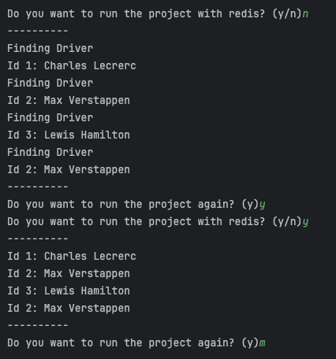

# redis-cache
 
The purpose of this project is to test caching using Redis.
The Redis will reduce the load of the primary data sources, enhance data retrieval speed, 
and optimize overall application performance.

# Docker configurations

You can run the application in an isolated and consistent environment.

