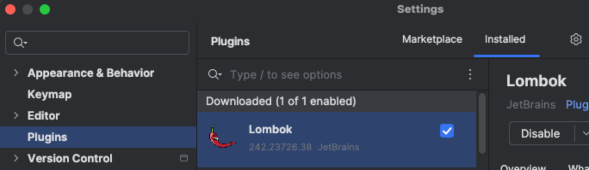
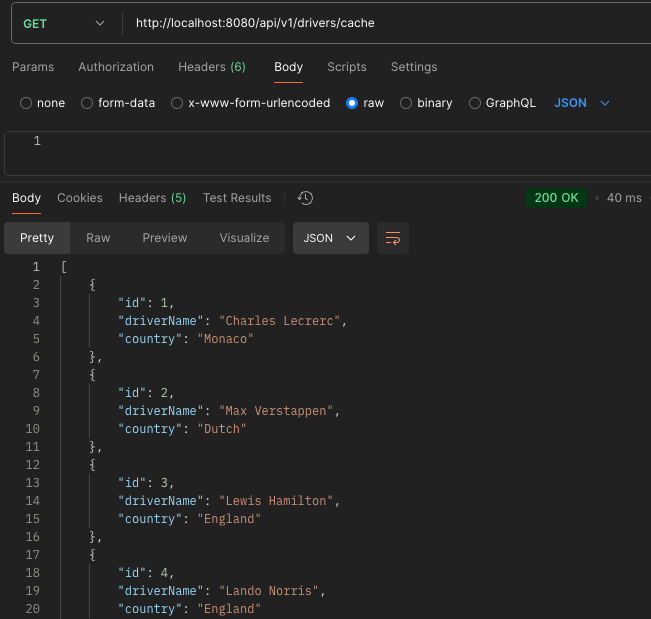

# Redis Cache

---
The purpose of this project is to test caching using Redis.
The Redis will reduce the load of the primary data sources, enhance data retrieval speed, 
and optimize overall application performance.

Technologies used: Java 17, Spring Boot, Redis.

- [Installation](#installation)
- [Configuration](#configuration)
- [Execute](#execute)
- [Documentation](#documentation)
---
## Installation

1. Clone the repository:

```bash
git clone https://github.com/felipebabel/redis-cache
```

2. Install dependencies with Maven
```bash
mvn clean install
```
---
## Configuration

1. It's necessary to install the Lombok Plugin in settings.



2. Java 17 must be installed and configured on your machine
---
## Execute

To run the microservice, you can either use the following Maven command
```task
mvn spring-boot:run
```
Or run the main class directly from your IDE:
[RedisCacheApplication.java](src/main/java/com/redis/RedisCacheApplication.java)

   
The API will be accessible at http://localhost:8080

Postman request example:



---
## Documentation
Interactive API documentation is available via Swagger UI.
Access it here:
[Swagger UI](http://localhost:8080/swagger-ui/index.html#/)