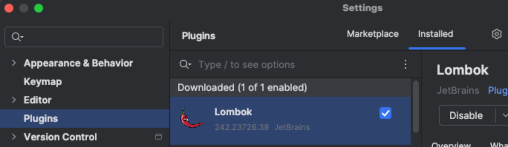
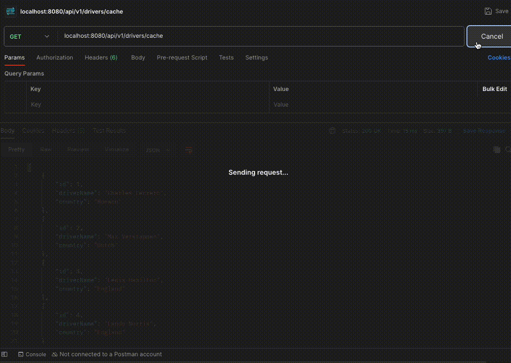

# 🚀 Redis Cache

---
The purpose of this project is to test caching using Redis.
The Redis will reduce the load of the primary data sources, enhance data retrieval speed, 
and optimize overall application performance.

Technologies used: Java 17, Spring Boot, Redis.

---
## 🛠️ Installation

Clone the repository:

```bash
git clone https://github.com/felipebabel/redis-cache
```

Build the project with Maven:
```bash
mvn clean install
```
---

## 🐳 Docker Setup
Redis must be running locally for the application to work. You can start a Redis container using Docker:
```bash
docker run --name redis -p 6379:6379 -d redis
```

This command pulls the latest Redis image (if not already available) and runs it on port 6379.

Make sure Docker is installed and running on your machine.

---
## ⚙️ Configuration
- Java 17

- Lombok Plugin: Make sure the Lombok plugin is installed and enabled in your IDE.



---
## ▶️ Running the Application

You can start the application in one of two ways:

Option 1: Using Maven
```bash
mvn spring-boot:run
```
Option 2: From your IDE
Run the main class: [RedisCacheApplication.java](src/main/java/com/redis/RedisCacheApplication.java)

--- 

## 📡 API Usage

- Example cURL request to test the caching endpoint:

```bash
curl --location 'http://localhost:8080/api/v1/drivers/cache'
```
This will trigger a caching mechanism that stores and retrieves driver data using Redis.


- Example cURL request to test the endpoint without caching:
```bash
curl --location 'localhost:8080/api/v1/drivers/withoutCache'```
```

This endpoint simulates 1 second of delay per driver record fetched, mimicking a slow data source.

It’s useful for comparing performance with and without Redis caching.


---


## 🎥 Demo



---
## 📚 Documentation

Interactive API documentation is available via Swagger UI.
[Swagger UI](http://localhost:8080/swagger-ui/index.html#/)